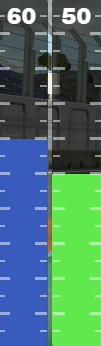
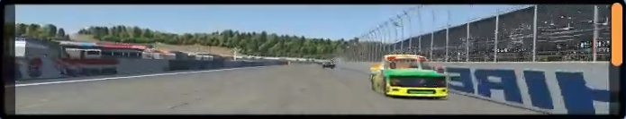
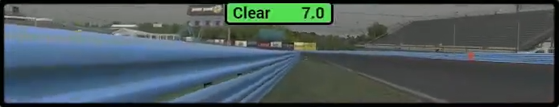

# benofficial2's Official Overlays
*Copyright 2023-2025 benofficial2*

## Overview

With benofficial2's Official Overlays you get a simple collection of free overlays for [iRacing](https://www.iracing.com/). The overlays are made with [SimHub](https://www.simhubdash.com/download-2/), which means they are fully customizable, and don't require any other executable to run in the background.

<a href="https://youtu.be/Bj29vDSf8bw?si=UCBgdk9UT7WfN2Eg&t=143">

  

</a>

To see them in action, click the image above for a video demo.

### Included in the collection

- **[Multi-Class Standings](#multi-class-standings)**: shows the live leaderboard in up to 4 car classes
- **[Standings](#standings)**: shows the live leaderboard in the player's car class
- **[Relative](#relative)**: shows drivers ahead / behind on track
- **[Track Map](#track-map)**: shows cars on a map
- **[Delta Bar](#delta-bar)**: gives you feedback on your pace with time and speed deltas
- **[Inputs Telemetry](#inputs-telemetry)**: shows pedal inputs and a graph
- **[Dash Overlay](#dash-overlay)**: shows various in-car settings and statuses (DRS, ERS, Fuel, BB, etc.)
- **[Setup Cover](#setup-cover)**: For streamers, hides the setup page when in garage
- **[Twitch Chat](#twitch-chat)**: For streamers, shows your chat on screen
- **[Launch Assist](#launch-assist)**: shows precise pedal inputs to nail a perfect start
- **[Spotter](#spotter)**: shows orange bars when side-by-side with another car
- **[Fuel Calculator](#fuel-calculator)**: when in garage, shows how much fuel is needed for the race
- **[Wind](#wind)**: show the speed & direction of wind relative to the player car rotation

## How to Install

### 1) Install SimHub if you don't have it already

[Download SimHub](https://www.simhubdash.com/download-2/) and install it if you don't have it already. It is needed to run the overlays.

### 2) Install benofficial2's Official Overlays

[Download benofficial2's Official Overlays](https://github.com/fixfactory/bo2-official-overlays/releases) from the releases page and run the installer. You will be able to choose which overlays you wish to install. Comes with an uninstaller. If you are updating from an older version, simply run the installer to install over. Your layouts and configuration options will persist.

### 3) Launch SimHub and enable benofficial2 plugin

When launching SimHub for the first time after installing the overlays, SimHub will ask if you want to enable the benofficial2 plugin. **Enable** it and toggle **Show in left main menu** to be able to configure the overlay options.

  

Also make sure you have not disabled the Dash Studio and Statistics plugins as they are needed to run the overlays. You can see which plugins are enabled by clicking **Add/remove features** in SimHub's left main menu.

  

  

*Note: since version 2.0 the RSC plugins are no longer needed to run the overlays. They can be disabled to reduce CPU usage if you don't need them for anything else.*

*Note: for the security-minded power-user, you can also install without running the installer by cloning this repo and copying all the folders from `\Overlays` and pasting them in this SimHub directory: `C:\Program Files (x86)\SimHub\DashTemplates`. Then compile the plugin in `\Plugin` with Visual Studio and copy `benofficial2.Plugin.dll` to `C:\Program Files (x86)\SimHub`.*

## How to Use

### 1) Create an overlay layout in SimHub

Once installed, the overlays will show up in **SimHub** in the **Dash Studio** menu under the **Overlays** tab. From there, create a **New overlay layout** and add the overlays you want to use. You'll be able to adjust the screen position and size for each overlay. Then **Save layout**.

  

Make sure to toggle **Visible** **ON** and **Hidden** **OFF**. Also toggle the **AUTO** load button so they conveniently load everytime you run SimHub. Now overlays will become visible on their own when in-car.

  

### 2) Important iRacing Configuration

1) In the iRacing UI (the launcher), go to **Settings** (bottom left corner) and navigate to **Options** > **Network**. Make sure to select the highest **Connection Speed**.

2) Set the **Max Cars** setting to **63** in iRacing in-game **Graphic Settings** and restart the game.

This is to ensure that iRacing sends the complete telemetry data for every car in the session so the overlays work properly.

### 3) Configure overlay options

From SimHub's **Left main menu**, select **benofficial2** to access the overlay configuration options. Various options can be changed there to change the look and behavior of the overlays.

  

### 4) Optional setup in OBS

For streaming, get the web source url by selecting **Copy OBS browser address to clipboard** from the **More** menu on an overlay in the overlay list.

For a two-PC streaming setup, replace **127.0.0.1** by the **IP Address** of your **Gaming PC**.

## Multi-Class Standings

Shows the live **Leaderboard** for up to 4 car classes. Optional columns: **Car Logo**, **Gap**, **Best Lap Time**, **Last Lap Time**. See the **benofficial2 plugin** page (in the left menu) for all options.

  

## Standings

Shows the live **Leaderboard** for the player's car class. Can show up to 25 drivers and have **Lead-Focused** rows (configurable in plugin options). The driver's **iRating** is shown with their **License Class** color. The **Tire Compound** indicator also serves as an **On-Track** indicator. In a race, the **Gap to Leader** and **Last Pit Stop Lap** are shown. In practice and qualification, the **Best Lap Time** is shown. For streamers, the large header makes it clear to your viewers if you're in a race or practice session.

  

  

## Relative

Shows the nearby drivers **Ahead & Behind** on-track. This includes cars from every car class. In blue are cars that are a lap down and in red are those a lap ahead. The **Out Lap Indicator** shows when a car is on an out-lap. The last column shows the **Gap** in seconds to that car. The header shows the **Strength of Field** and **Incident Count**. The temperature is the **Track Temperature** and the time is your computer's **Local Time**.

  

## Track Map

Shows car positions on a map. Supports multi-class colors.

  

  

## Delta Bar

Gives you feedback on your pace. The **Delta Time** (center) and **Delta Speed** (right) are relative to your session's best clean lap. In qualifying, they are relative to your all-time best lap. On the left, in a race, you get **Gap** and last lap **Interval** information about your nearest competitor ahead and behind. Useful to know if your are improving relative to them.

  

  

  

This delta bar can help you improve your lap times by giving you on-the-spot feedback in a corner. Because the **Delta Speed** field is big enough, you'll be able to see it change color while keeping your eyes on the track. So you'll know instantly if your mid-corner speed was faster/slower for example. You'll learn quickly what works and what doesn't.

*Note: if the delta bar doesn't show immediately, it is because it doesn't have a clean reference lap to compare against yet. It will show up once you complete a full lap without incident.*

## Inputs Telemetry

Shows the current **Gear**, **Speed** and a graph of **Pedal Input Traces** over time. This is useful to understand bad habits. This overlay is modular meaning you can hide parts you don't need as well as adjusting the width of the traces (see configuration options in benofficial2 plugin).

  

## Dash Overlay

Useful when the in-game steering wheel is not visible in your FOV. This overlay shows various in-car settings and statuses. The green boxes typically show statuses about "going faster" such as **DRS**, **ERS**, **P2P**, **OT** (Super Formula), and **Fuel Mix**. 

  

  

The yellow boxes are for **Fuel** and **Laps Remaining Estimate**. A **Pit Indicator** will blink when it's time to pit. The orange boxes are for various in-car settings such as **Entry Diff**. And finally the red boxes are for **Brake Bias** adjustments.

  

## Setup Cover

For streamers, shows an animation that hides your car setup values when entering the garage.

## Twitch Chat

For streamers, shows your chat on-screen so you can keep up with chat. Powered by [ChatIS](https://chatis.is2511.com/).

  

## Launch Assist

When stopped, this overlay shows precise pedal input bars to help you consistently hold a desired value. For example with the F1 W13, you set your clutch bitepoint to ~60% and hold 50% throttle. At 52% you might spin out, so this overlay helps you be consistent.

There's some randomness to the clutch bitepoint in iRacing, so make sure to experiment to find a safe value.

  

## Spotter

Shows orange bars when side-by-side with another car. This complements your audio spotter as it will show up the moment your spotter starts talking. The size of the orange bar gives your an idea of the amount of car overlap and how fast you are passing them so you can time the perfect move. 

  

Also comes with a **Rejoin Helper** that will show up when stopped or off-track, telling you how safe it is to rejoin by giving you the gap to the next incoming car. Quicker than looking at Relatives.

  

Designed to be placed over the virtual mirror, but can be placed wherever you want it to be.

## Fuel Calculator

Shows up when in the garage / setup screen and tells you how much fuel is needed to start the race. Supports heat races and will determine if the race is limited by time or laps when both are specified. Useful for leagues that have a custom race length.

  

A blinking **Fuel Warning** lights up when you're about to grid with an under-fueled setup. Never start a race with a qualification setup again!

  

*Beta Warning: use at your own risk. I might have missed an edge case but so far so good in my tests. Please report any issue or feedback in my [Discord](https://discord.gg/s2834nmdYx).*

## Wind

Shows the speed & direction of wind relative to the player car rotation. Useful to understand the impact of wind on straight line speed and cornering grip.

  

## Help & Feedback

For general help with using SimHub, don't hesitate to get help on the [official SimHub Discord server](https://discord.com/invite/nBBMuX7).

For help, report problems, and give feedback about the overlays, please hop-in my Discord server: [Ben's Official Server](https://discord.gg/s2834nmdYx).

## Credits & Thanks

Thanks to **Wotever** for making [SimHub](https://www.simhubdash.com/download-2/). It is such a powerful and essential piece of sim-racing software. Consider [buying a license](https://www.simhubdash.com/get-a-license/) to support him.

Thanks to **Romainrob** for making the excellent [iRacing Extra Properties](https://www.simhubdash.com/community-2/dashboard-templates/romainrobs-collection/) plugin and his collection of overlays which was a great inspiration.

The overlays in this collection are made by **benofficial2**. 
If you like them, consider following me on:
- [**Twitch**](https://www.twitch.tv/benofficial2)
- [**YouTube**](https://www.youtube.com/@benofficial2?sub_confirmation=1)
- [**Bluesky**](https://bsky.app/profile/benofficial2.bsky.social)

And thank *you* for using them!