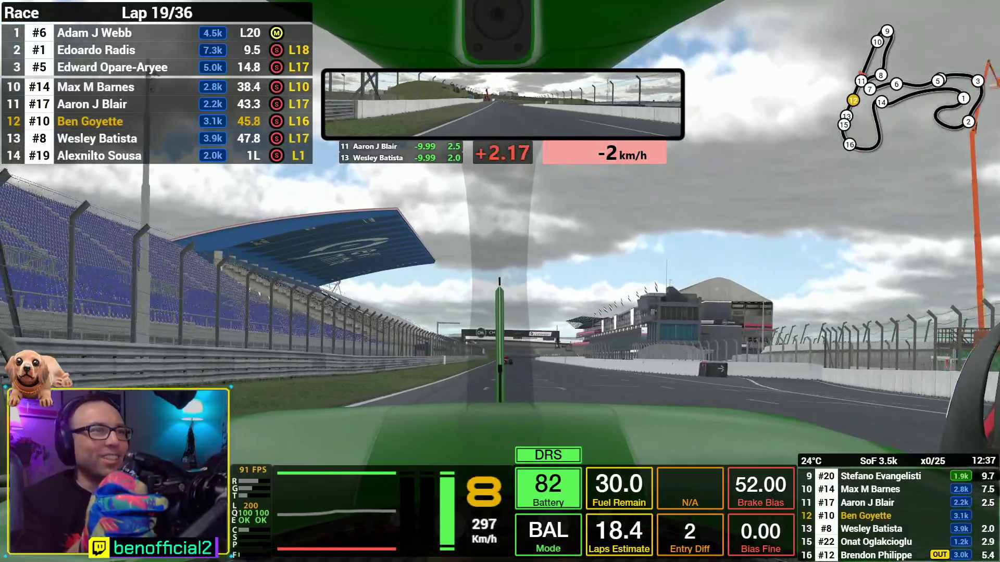
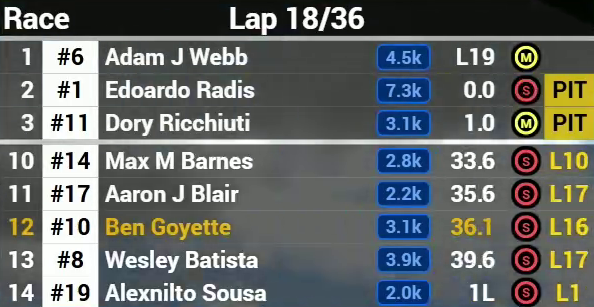
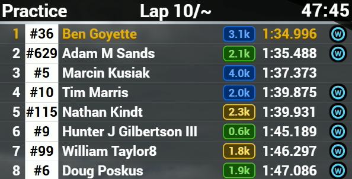
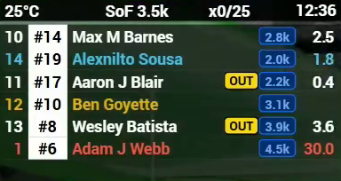

# benofficial2's Official Overlays
*Copyright 2024 Fixfactory*

## Overview

With benofficial2's Official Overlays you get a simple collection of free overlays for [iRacing](https://www.iracing.com/). The overlays are made with SimHub, which means they are fully customizable, and don't require any other executable to run in the background.

<a href="https://www.youtube.com/watch?v=pucGAwFpnjw">

  

</a>

To see them in action, click the image above for a video demo.

Included in the collection:
- **Standings box**: showing the leaderboard
- **Relative box**: showing drivers ahead / behind
- **Track Map**: showing car positions on a map
- **Delta bar**: giving you feedback on your pace
- **Inputs Telemetry**: showing a graph of pedal inputs
- **Dash** - showing various in-car settings and statuses (DRS, ERS, Fuel, BB, etc.)

## How to Get

Download and run the installer available from the [releases page](https://github.com/fixfactory/bo2-official-overlays/releases). You will be able to choose which overlays you wish to install. Comes with an uninstaller.

Or, for the security-minded power-user, you can install without running any executable by cloning this repo and copying all the folders from `\Overlays` and pasting them into this folder in your SimHub directory: `C:\Program Files (x86)\SimHub\DashTemplates`

If you don't have them already, you must install these two:
- [SimHub](https://www.simhubdash.com/download-2/): needed to run the overlays
- [Romainrob's collection](https://www.simhubdash.com/community-2/dashboard-templates/romainrobs-collection/): needed for the excellent extra properties plugin

## How to Use

### Create an overlay layout in SimHub

Once installed, the overlays will show up in *SimHub* in the *Dash Studio* menu under the *Overlays* tab. From there, create a *New overlay layout* and add the overlays you want to it. You'll be able to adjust the position and size of every overlay. Make sure to toggle *Visible* **ON** and *Hidden* **OFF**. Also toggle the *AUTO* load button so they load everytime you run SimHub. The overlays will then become visible on their own when in-car.

  

If you need help setting up your overlay layout in SimHub, don't hesitate to get help on the [official SimHub Discord server](https://discord.com/invite/nBBMuX7).

### Important iRacing Configuration

1) In-game, set the **Max Cars** setting to **63** in *iRacing Graphic Settings* and restart the game.

2) In the iRacing UI (the launcher), go to **My Account** (top right corner) and navigate to the **Connection** tab. Make sure to select the highest **Connection Type**.

This is to ensure that iRacing has the telemetry data of every car in the session so the overlays work properly.

## SimHub iRacing Extras Configuration

For the overlays to work property, configure the following settings in the **iRacing Extras** menu in **SimHub** (this is Romainrob's plugin):
- **Live position update** = On
- **Standings Maximum rows** = 8
- **Standings Lead focused rows** = 3
- **Standings iRating format** = 1.3k
- **Standings Default class** = Player class
- **Standings Default focus** = Player
- **Relatives Default class** = Multiclass

This is because my overlays don't support every setting (yet).

### Setup in OBS

For streaming, get the web source url by selecting *Copy OBS browser address to clipboard* from the *More* menu.

For a two-PC streaming setup, replace **127.0.0.1** by the **IP Address** of your **Gaming PC**.

## Standings Box

Shows the **Leaderboard** for the current session. Currently limited to 8 drivers for simplicity. It shows the driver **Name**, **Rating**, **Tire Compound**, **In-pit Status**, **Best Lap Time** (practice and qual only), **Gap to Leader**, and **Last Pitstop Lap** (race only).

  

  

  

## Relative Box

Showing the nearby drivers **Ahead & Behind** you on-track. This includes cars from every class, cars that are a lap down (blue) or a lap ahead (red). The **Out** indicator shows when a car is on an out-lap. The last column shows your **Gap** in seconds to that car. The temperature is the **Track Temperature**.

  

  

## Track Map

Showing car positions on a map. Supports multi-class colors.

  

  

## Delta Bar

Giving you feedback on your pace. The **Delta Time** (center) and **Delta Speed** (right) are relative to your session's best lap. On the left, in a race, you get **Gap** and **Interval** information about your nearest competitor ahead and behind. Useful to know if your are improving or not relative to them.

  

  

  

## Inputs Telemetry

Showing the current **Gear**, **Speed** and a graph of pedal inputs over time. This is useful to understand bad habits.

  

  

  

## Dash

Showing various in-car settings and statuses. The green boxes typically show statuses about "going faster" such as **DRS**, **ERS**, **P2P**, **OT** (Super Formula), and **Fuel Mix**. The yellow boxes are for **Fuel** and **Laps Remaining Estimate**. A **Pit Indicator** will blink when it's time to pit. The orange boxes are for various in-car settings such as **Entry Diff**. And finally the red boxes are for **Brake Bias** adjustments.

All those boxes are customizable per-car by editting the javascript files in the overlay.

  

  

  

## Help & Feedback

For general help with using SimHub, don't hesitate to get help on the [official SimHub Discord server](https://discord.com/invite/nBBMuX7).

For help, report problems, and give feedback about the overlays, please hop-in my Discord server: [Ben's Official Server](https://discord.gg/s2834nmdYx).

## Credit & Thanks

Thanks to **Wotever** for making [SimHub](https://www.simhubdash.com/download-2/), such a powerful and essential piece of sim-racing software. Consider [buying a license](https://www.simhubdash.com/get-a-license/) to support him.

Thanks to **Romainrob** for making the excellent [iRacing Extra Properties](https://www.simhubdash.com/community-2/dashboard-templates/romainrobs-collection/) plugin and his collection of overlays on which mine are built from. Consider [donating to him](https://www.paypal.com/paypalme/Romainrob8045) too.

The overlays in this collection are made by **benofficial2**. 
If you like them, consider following me on:
- [**Twitch**](https://www.twitch.tv/benofficial2)
- [**YouTube**](https://www.youtube.com/@benofficial2?sub_confirmation=1)
- [**Bluesky**](https://bsky.app/profile/benofficial2.bsky.social)

And thank *you* for using them!